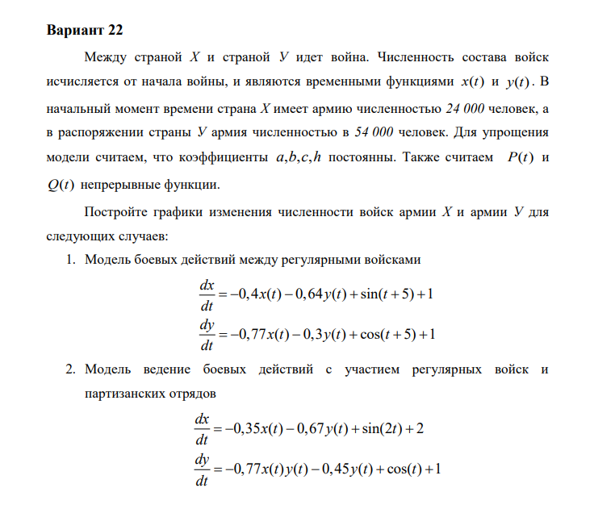
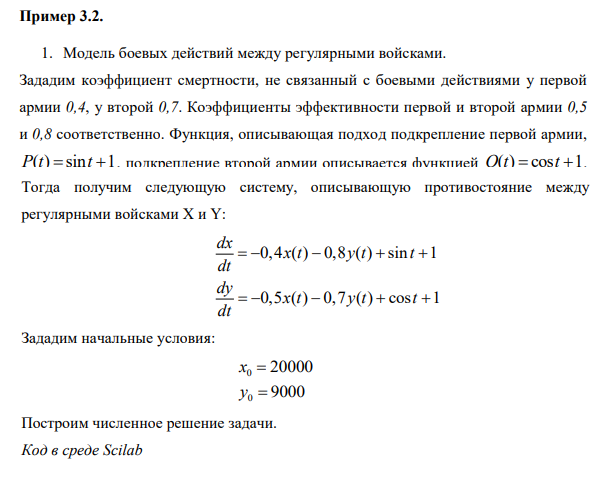
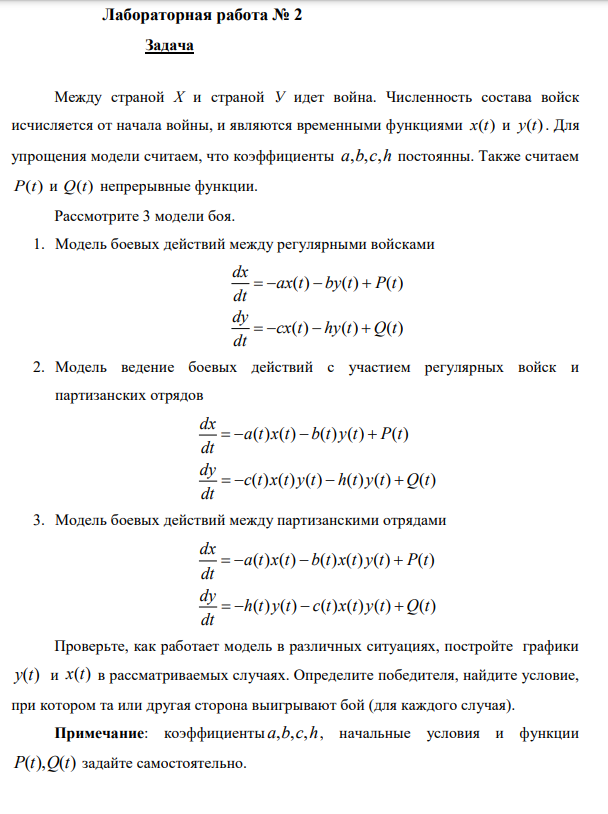
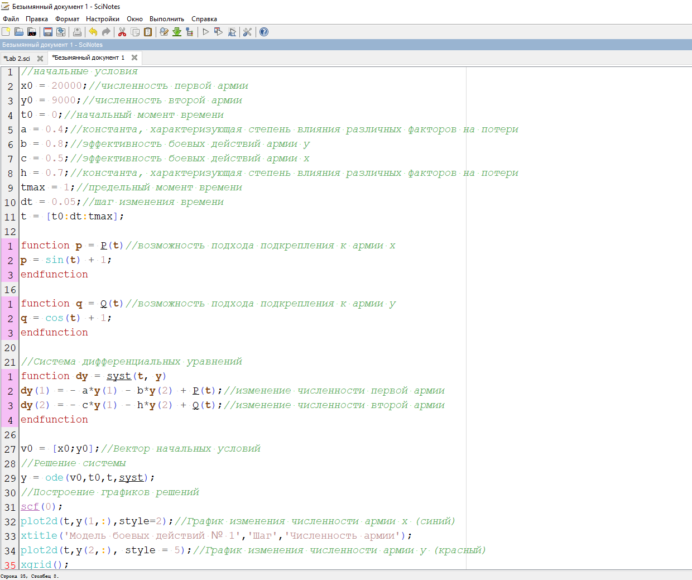
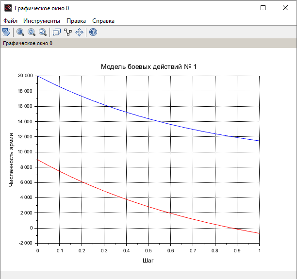
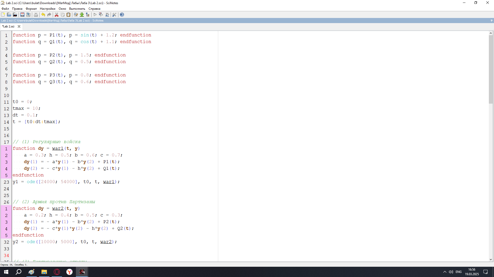
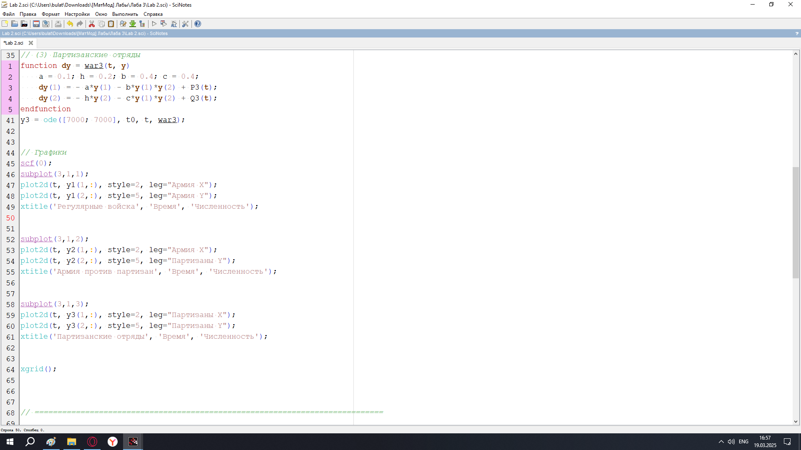
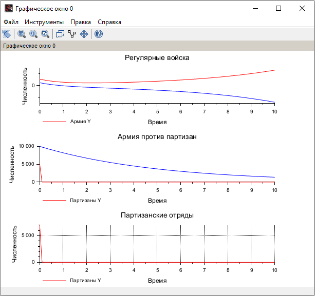

---
## Front matter
lang: ru-RU
title: Лабораторная Работа №3. Модель боевых действий
subtitle: Математическое моделирование
author:
  - Исаев Б.А.
institute:
  - Российский университет дружбы народов им. Патриса Лумумбы, Москва, Россия

## i18n babel
babel-lang: russian
babel-otherlangs: english

## Formatting pdf
toc: false
toc-title: Содержание
slide_level: 2
aspectratio: 169
section-titles: true
theme: metropolis
header-includes:
 - \metroset{progressbar=frametitle,sectionpage=progressbar,numbering=fraction}
 - '\makeatletter'
 - '\beamer@ignorenonframefalse'
 - '\makeatother'

## Fonts
mainfont: Arial
romanfont: Arial
sansfont: Arial
monofont: Arial
---

## Докладчик

  * Исаев Булат Абубакарович
  * НПИбд-01-22
  * Российский университет дружбы народов
  * [1132227131@pfur.ru]

## Цели и задачи

Между страной Х и страной У идет война. Численность состава войск
исчисляется от начала войны, и являются временными функциями
xt() и yt(). Для упрощения модели считаем, что коэффициенты a, b, c, h постоянны. Также считаем P(t) и Q(t) непрерывные функции.
Рассмотрите 3 модели боя.

1. Модель боевых действий между регулярными войсками
dx/dt = -ax(t) - by(t) + P(t)
dy/dt = -cx(t) - hy(t) + Q(t)

2. Модель ведение боевых действий с участием регулярных войск и
партизанских отрядов 
dx/dt = -a(t)x(t) - b(t)y(t) + P(t)
dy/dt = -c(t)x(t)y(t) - h(t)y(t) + Q(t)

3. Модель боевых действий между партизанскими отрядами
dx/dt = -a(t)x(t) - b(t)x(t)y(t) + P(t)
dy/dt = -h(t)y(t) - c(t)h(t)y(t) + Q(t)

Проверьте, как работает модель в различных ситуациях, постройте графики
y(t) и x(t) в рассматриваемых случаях. Определите победителя, найдите условие, при котором та или другая сторона выигрывают бой (для каждого случая).
**Примечание:** коэффициенты a, b, c, h, начальные условия и функции P(t), Q(t) задайте самостоятельно

## Выбор варианта

{#fig:001 width=70%}

## Полученный вариант

{#fig:002 width=70%}

## Пример 3.2

{#fig:003 width=70%}

## Задача лабораторной

{#fig:004 width=70%}

## Код лабораторной (Scilab)

{#fig:005 width=70%}

## График

{#fig:006 width=70%}

## Выполнение задачи (Часть 1)

{#fig:007 width=70%}

## Выполнение задачи (Часть 2)

{#fig:008 width=70%}

## Графики

{#fig:009 width=70%}

## Вывод

Мы научились работать с моделью боевых действий
