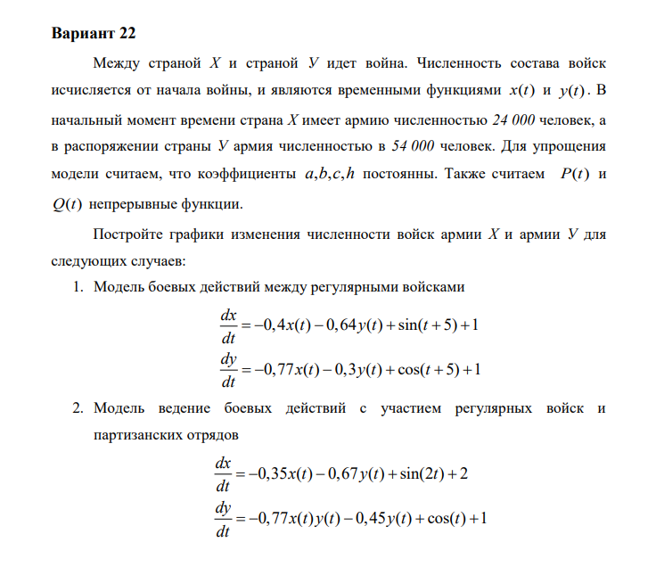
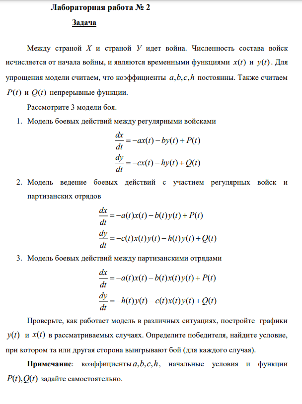
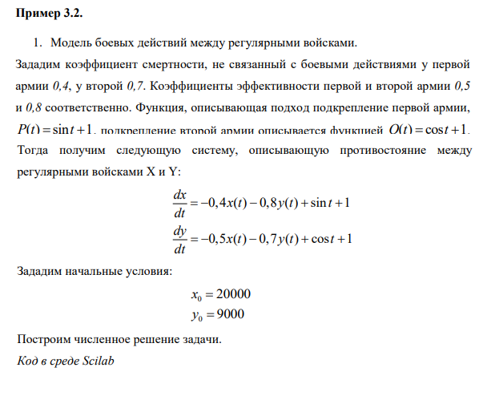
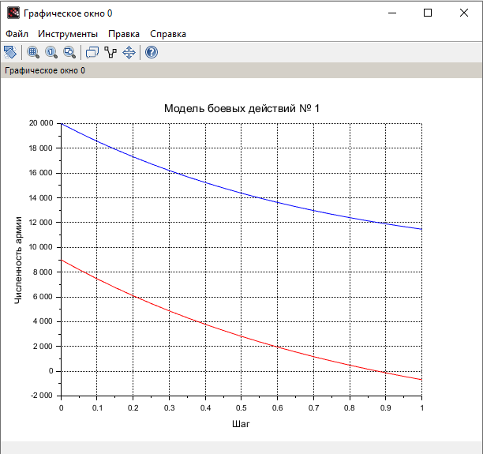
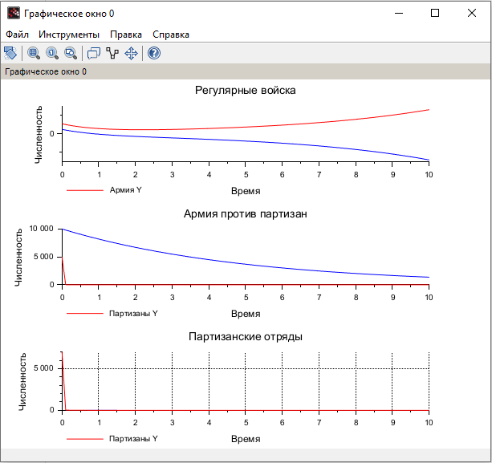

---
## Front matter
title: "Отчёт по лабораторной работе №3"
subtitle: "Дисциплина: Математическое моделирование"
author: "Исаев Булат Абубакарович НПИбд-01-22"

## Generic otions
lang: ru-RU
toc-title: "Содержание"

## Bibliography
bibliography: bib/cite.bib
csl: pandoc/csl/gost-r-7-0-5-2008-numeric.csl

## Pdf output format
toc: true # Table of contents
toc-depth: 2
lof: true # List of figures
lot: true # List of tables
fontsize: 12pt
linestretch: 1.5
papersize: a4
documentclass: scrreprt
## I18n polyglossia
polyglossia-lang:
  name: russian
polyglossia-otherlangs:
  name: english
## I18n babel
babel-lang: russian
babel-otherlangs: english
## Fonts
mainfont: Arial
romanfont: Arial
sansfont: Arial
monofont: Arial
mainfontoptions: Ligatures=TeX
romanfontoptions: Ligatures=TeX
sansfontoptions: Ligatures=TeX,Scale=MatchLowercase
monofontoptions: Scale=MatchLowercase,Scale=0.9
## Biblatex
biblatex: true
biblio-style: "gost-numeric"
biblatexoptions:
  - parentracker=true
  - backend=biber
  - hyperref=auto
  - language=auto
  - autolang=other*
  - citestyle=gost-numeric
## Pandoc-crossref LaTeX customization
figureTitle: "Рис."
tableTitle: "Таблица"
listingTitle: "Листинг"
lofTitle: "Список иллюстраций"
lotTitle: "Список таблиц"
lolTitle: "Листинги"
## Misc options
indent: true
header-includes:
  - \usepackage{indentfirst}
  - \usepackage{float} # keep figures where there are in the text
  - \floatplacement{figure}{H} # keep figures where there are in the text
---

# Цель работы

Между страной Х и страной У идет война. Численность состава войск
исчисляется от начала войны, и являются временными функциями
xt() и yt(). Для упрощения модели считаем, что коэффициенты a, b, c, h постоянны. Также считаем P(t) и Q(t) непрерывные функции.
Рассмотрите 3 модели боя.

1. Модель боевых действий между регулярными войсками
dx/dt = -ax(t) - by(t) + P(t)
dy/dt = -cx(t) - hy(t) + Q(t)

2. Модель ведение боевых действий с участием регулярных войск и
партизанских отрядов 
dx/dt = -a(t)x(t) - b(t)y(t) + P(t)
dy/dt = -c(t)x(t)y(t) - h(t)y(t) + Q(t)

3. Модель боевых действий между партизанскими отрядами
dx/dt = -a(t)x(t) - b(t)x(t)y(t) + P(t)
dy/dt = -h(t)y(t) - c(t)h(t)y(t) + Q(t)

Проверьте, как работает модель в различных ситуациях, постройте графики
y(t) и x(t) в рассматриваемых случаях. Определите победителя, найдите условие, при котором та или другая сторона выигрывают бой (для каждого случая).
**Примечание:** коэффициенты a, b, c, h, начальные условия и функции P(t), Q(t) задайте самостоятельно

# Выполнение лабораторной работы

Формула для выбора варианта: `(1132227131 % 70) + 1` = 22 вариант.

{#fig:001 width=70%}

{#fig:002 width=70%}

{#fig:003 width=70%}

{#fig:004 width=70%}

# Код лабораторной

**Начало**

//начальные условия
x0 = 20000;//численность первой армии
y0 = 9000;//численность второй армии
t0 = 0;//начальный момент времени
a = 0.4;//константа, характеризующая степень влияния различных факторов на потери
b = 0.8;//эффективность боевых действий армии у
c = 0.5;//эффективность боевых действий армии х
h = 0.7;//константа, характеризующая степень влияния различных факторов на потери
tmax = 1;//предельный момент времени
dt = 0.05;//шаг изменения времени
t = [t0:dt:tmax];

function p = P(t)//возможность подхода подкрепления к армии х
p = sin(t) + 1;
endfunction

function q = Q(t)//возможность подхода подкрепления к армии у
q = cos(t) + 1;
endfunction

//Система дифференциальных уравнений
function dy = syst(t, y)
dy(1) = - a*y(1) - b*y(2) + P(t);//изменение численности первой армии
dy(2) = - c*y(1) - h*y(2) + Q(t);//изменение численности второй армии
endfunction

v0 = [x0;y0];//Вектор начальных условий
//Решение системы
y = ode(v0,t0,t,syst);
//Построение графиков решений
scf(0);
plot2d(t,y(1,:),style=2);//График изменения численности армии х (синий)
xtitle('Модель боевых действий № 1','Шаг','Численность армии');
plot2d(t,y(2,:), style = 5);//График изменения численности армии у (красный)
xgrid();

**Конец**

{#fig:006 width=70%}

# Наш код

**Начало**

function p = P1(t), p = sin(t) + 1.2; endfunction
function q = Q1(t), q = cos(t) + 1.1; endfunction

function p = P2(t), p = 1.5; endfunction
function q = Q2(t), q = 0.5; endfunction

function p = P3(t), p = 0.8; endfunction
function q = Q3(t), q = 0.6; endfunction

t0 = 0;
tmax = 10;
dt = 0.1;
t = [t0:dt:tmax];

// (1) Регулярные войска
function dy = war1(t, y)
    a = 0.3; h = 0.5; b = 0.6; c = 0.7;
    dy(1) = - a*y(1) - b*y(2) + P1(t);
    dy(2) = - c*y(1) - h*y(2) + Q1(t);
endfunction
y1 = ode([24000; 54000], t0, t, war1);

// (2) Армия против Партизаны
function dy = war2(t, y)
    a = 0.2; h = 0.4; b = 0.5; c = 0.3;
    dy(1) = - a*y(1) - b*y(2) + P2(t);
    dy(2) = - c*y(1)*y(2) - h*y(2) + Q2(t);
endfunction
y2 = ode([10000; 5000], t0, t, war2);

// (3) Партизанские отряды
function dy = war3(t, y)
    a = 0.1; h = 0.2; b = 0.4; c = 0.4;
    dy(1) = - a*y(1) - b*y(1)*y(2) + P3(t);
    dy(2) = - h*y(2) - c*y(1)*y(2) + Q3(t);
endfunction
y3 = ode([7000; 7000], t0, t, war3);

// Графики
scf(0);
subplot(3,1,1);
plot2d(t, y1(1,:), style=2, leg="Армия X");
plot2d(t, y1(2,:), style=5, leg="Армия Y");
xtitle('Регулярные войска', 'Время', 'Численность');

subplot(3,1,2);
plot2d(t, y2(1,:), style=2, leg="Армия X");
plot2d(t, y2(2,:), style=5, leg="Партизаны Y");
xtitle('Армия против партизан', 'Время', 'Численность');

subplot(3,1,3);
plot2d(t, y3(1,:), style=2, leg="Партизаны X");
plot2d(t, y3(2,:), style=5, leg="Партизаны Y");
xtitle('Партизанские отряды', 'Время', 'Численность');

xgrid();

**Конец**

{#fig:009 width=70%}

# Выводы

Мы научились работать с моделью боевых действий

# Список литературы{.unnumbered}
[@wiki:bash]

::: {#refs}
:::