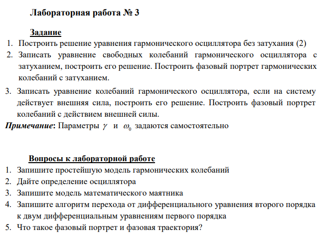

---
## Front matter
lang: ru-RU
title: Лабораторная Работа №4. Модель гармонических колебаний
subtitle: Математическое моделирование
author:
  - Исаев Б.А.
institute:
  - Российский университет дружбы народов им. Патриса Лумумбы, Москва, Россия

## i18n babel
babel-lang: russian
babel-otherlangs: english

## Formatting pdf
toc: false
toc-title: Содержание
slide_level: 2
aspectratio: 169
section-titles: true
theme: metropolis
header-includes:
 - \metroset{progressbar=frametitle,sectionpage=progressbar,numbering=fraction}
 - '\makeatletter'
 - '\beamer@ignorenonframefalse'
 - '\makeatother'

## Fonts
mainfont: Arial
romanfont: Arial
sansfont: Arial
monofont: Arial
---

## Докладчик

  * Исаев Булат Абубакарович
  * НПИбд-01-22
  * Российский университет дружбы народов
  * [1132227131@pfur.ru]

## Цели и задачи

1. Построить решение уравнения гармонического осциллятора без затухания (2)
2. Записать уравнение свободных колебаний гармонического осциллятора с
затуханием, построить его решение. Построить фазовый портрет гармонических
колебаний с затуханием.
3. Записать уравнение колебаний гармонического осциллятора, если на систему
действует внешняя сила, построить его решение. Построить фазовый портрет
колебаний с действием внешней силы.
**Примечание:** Параметры y и w_0 задаются самостоятельно

## Выбор варианта

{#fig:001 width=70%}

## Полученный вариант

{#fig:002 width=70%}

## Модель гармонических колебаний

{#fig:003 width=70%}

## Задача лабораторной

{#fig:004 width=70%}

## Код лабораторной (Scilab)

{#fig:005 width=70%}

## График

{#fig:006 width=70%}

## Выполнение задачи (Часть 1)

{#fig:007 width=70%}

## Выполнение задачи (Часть 2)

{#fig:008 width=70%}

## Графики

{#fig:009 width=70%}

## Вывод

Мы научились работать с моделью гармонических колебаний
