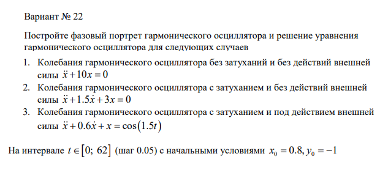
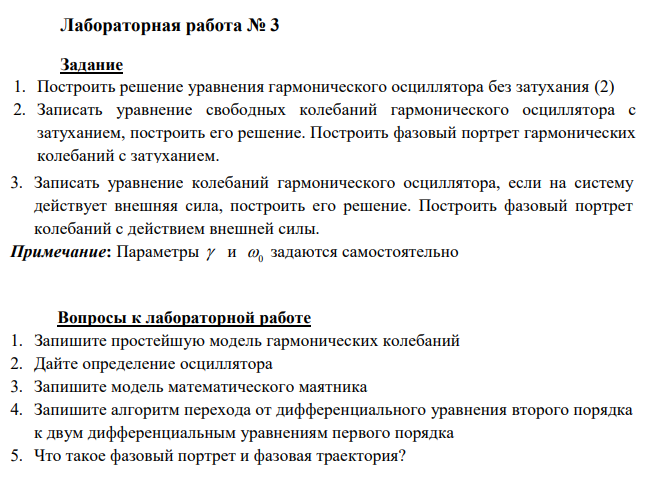
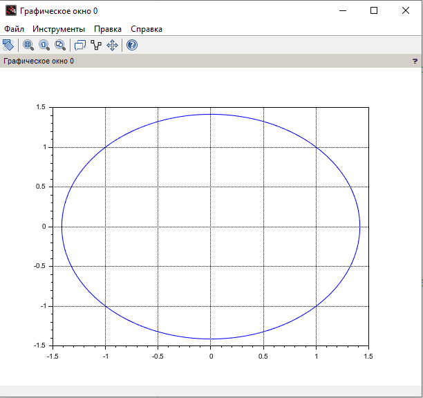

---
## Front matter
title: "Отчёт по лабораторной работе №4"
subtitle: "Дисциплина: Математическое моделирование"
author: "Исаев Булат Абубакарович НПИбд-01-22"

## Generic otions
lang: ru-RU
toc-title: "Содержание"

## Bibliography
bibliography: bib/cite.bib
csl: pandoc/csl/gost-r-7-0-5-2008-numeric.csl

## Pdf output format
toc: true # Table of contents
toc-depth: 2
lof: true # List of figures
lot: true # List of tables
fontsize: 12pt
linestretch: 1.5
papersize: a4
documentclass: scrreprt
## I18n polyglossia
polyglossia-lang:
  name: russian
polyglossia-otherlangs:
  name: english
## I18n babel
babel-lang: russian
babel-otherlangs: english
## Fonts
mainfont: Arial
romanfont: Arial
sansfont: Arial
monofont: Arial
mainfontoptions: Ligatures=TeX
romanfontoptions: Ligatures=TeX
sansfontoptions: Ligatures=TeX,Scale=MatchLowercase
monofontoptions: Scale=MatchLowercase,Scale=0.9
## Biblatex
biblatex: true
biblio-style: "gost-numeric"
biblatexoptions:
  - parentracker=true
  - backend=biber
  - hyperref=auto
  - language=auto
  - autolang=other*
  - citestyle=gost-numeric
## Pandoc-crossref LaTeX customization
figureTitle: "Рис."
tableTitle: "Таблица"
listingTitle: "Листинг"
lofTitle: "Список иллюстраций"
lotTitle: "Список таблиц"
lolTitle: "Листинги"
## Misc options
indent: true
header-includes:
  - \usepackage{indentfirst}
  - \usepackage{float} # keep figures where there are in the text
  - \floatplacement{figure}{H} # keep figures where there are in the text
---

# Цель работы

1. Построить решение уравнения гармонического осциллятора без затухания (2)
2. Записать уравнение свободных колебаний гармонического осциллятора с
затуханием, построить его решение. Построить фазовый портрет гармонических
колебаний с затуханием.
3. Записать уравнение колебаний гармонического осциллятора, если на систему
действует внешняя сила, построить его решение. Построить фазовый портрет
колебаний с действием внешней силы.
**Примечание:** Параметры y и w_0 задаются самостоятельно

# Выполнение лабораторной работы

Формула для выбора варианта: `(1132227131 % 70) + 1` = 22 вариант.

{#fig:001 width=70%}

{#fig:002 width=70%}

{#fig:003 width=70%}

{#fig:004 width=70%}

# Код лабораторной

**Начало**

//Параметры осциллятора (x'' + g* x' + w^2* x = f(t)) | (w - частота) | (g - затухание)
w = 1.00;
g = 0.00;

//Правая часть уравнения f(t)
function f=f(t)
f = sin(0.0.* t);
endfunction

///Вектор-функция f(t, x) для решения системы дифференциальных уравнений x' = y(t, x) где x - искомый вектор
function dx=y(t, x)
dx(1) = x(2);
dx(2) = -w.* w.* x(1) - g.* x(2) - f(t);
endfunction

//Точка, в которой заданы начальные условия
t0 = 0;
//Вектор начальных условий x(t0) = x0
x0 = [-1; 1];
//Интервал на котором будет решаться задача
t = [0: 0.05: 50];
//Решаем дифференциальные уравнения с начальным условием x(t0) = x0 на интервале t с правой частью, заданной y и записываем решение в матрицу x
x = ode(x0, t0, t, y);
//Количество столбцов в матрице
n = size(x, "c");

//Переписываем отдельно x в y1, x' в y2
for i = 1: n
y1(i) = x(1, i);
y2(i) = x(2, i);
end

//Рисуем фазовый портрет: зависимость x(x')
plot(y1, y2);
xgrid();

**Конец**

{#fig:006 width=70%}

# Наш код

**Начало**

// Интервал времени
t0 = 0;
t_end = 62;
dt = 0.05;
t = t0:dt:t_end;

// Начальные условия
x0 = 0.8;
y0 = -1;
X0 = [x0; y0];

// Функция 1 
function dx = osc1(t, x)
    dx(1) = x(2);
    dx(2) = -10*x(1);
endfunction

// Функция 2
function dx = osc2(t, x)
    dx(1) = x(2);
    dx(2) = -1.5*x(2) - 3*x(1);
endfunction

// Функция 3
function dx = osc3(t, x)
    dx(1) = x(2);
    dx(2) = -0.6*x(2) - x(1) - cos(1.5*t);
endfunction

// Дифференциальные уравнения
solution1 = ode(X0, t0, t, osc1);
solution2 = ode(X0, t0, t, osc2);
solution3 = ode(X0, t0, t, osc3);

// График 1
scf(1);
subplot(3, 1, 1);
plot(solution1(1, :), solution1(2, :), "b");
xlabel("x (смещение)"); ylabel("x` (скорость)");
title("Фазовый портрет без затухания");
xgrid();

// График 2
scf(2);
plot(solution2(1, :), solution2(2, :), "r");
xlabel("x (смещение)"); ylabel("x` (скорость)");
title("Фазовый портрет с затуханием");
xgrid();

// График 3
scf(3);
plot(solution3(1, :), solution3(2, :), "g");
xlabel("x (смещение)"); ylabel("x` (скорость)");
title("Фазовый портрет с затуханием и внешней силой");
xgrid();

**Конец**

{#fig:009 width=70%}

# Выводы

Мы научились работать с моделью гармонических колебаний

# Вопросы к лабораторной работе 

1. Запишите простейшую модель гармонических колебаний - **x`` + ω^2x = 0. где:**
**x — смещение**
**ω = sqrt(k/m) — циклическая частота**
**k — жесткость пружины**
**m — масса**
**Решение этого уравнения имеет вид:**
**x(t) = A * cos(ωt + φ)**

2. Дайте определение осциллятора - **Осциллятор — это система, совершающая колебания вокруг состояния равновесия под действием внутренних или внешних сил.**
**Примеры:**
**Маятник**
**Электрический контур (LC-цепь)**
**Кварцевый резонатор**

3. Запишите модель математического маятника - **Если маятник длиной l колеблется под действием силы тяжести, его уравнение движения:**
**O + g/l * sin(O) = 0**
**При малых углах (sinO ≈ 0):**
**O + g/l * O = 0**

4. Запишите алгоритм перехода от дифференциального уравнения второго порядка к двум дифференциальным уравнениям первого порядка - **Чтобы представить уравнение второго порядка в виде системы первого порядка:**

**1. Вводим новую переменную: v = x` (скорость)**
**2. Записываем систему:**
**x` = v**
**v` = -ω^2 * x**

**Такой подход используется в численных методах.**

5. Что такое фазовый портрет и фазовая траектория? - **Фазовая траектория — это кривая в фазовом пространстве (ось x — положение, ось v — скорость), описывающая эволюцию системы**
**Фазовый портрет — это множество всех возможных фазовых траекторий при разных начальных условиях**

**Фазовый портрет помогает понять динамику системы:**

**Замкнутые траектории — периодические колебания (например, гармонический осциллятор)**
**Спираль к центру — затухающие колебания**
**Расходящиеся траектории — неустойчивость**

# Список литературы{.unnumbered}
[@wiki:bash]

::: {#refs}
:::
