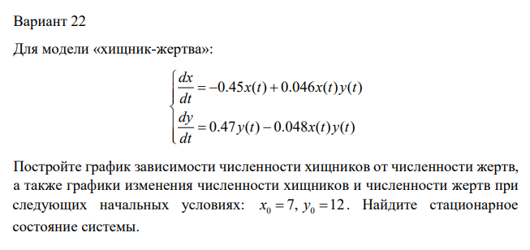
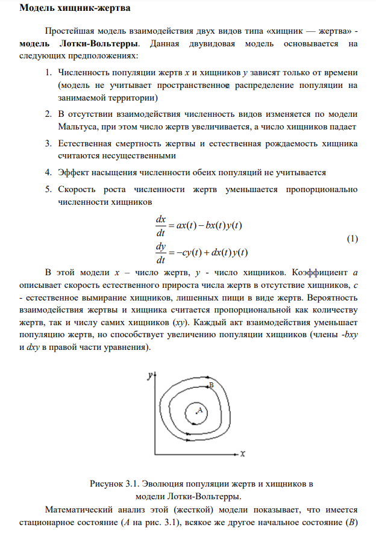
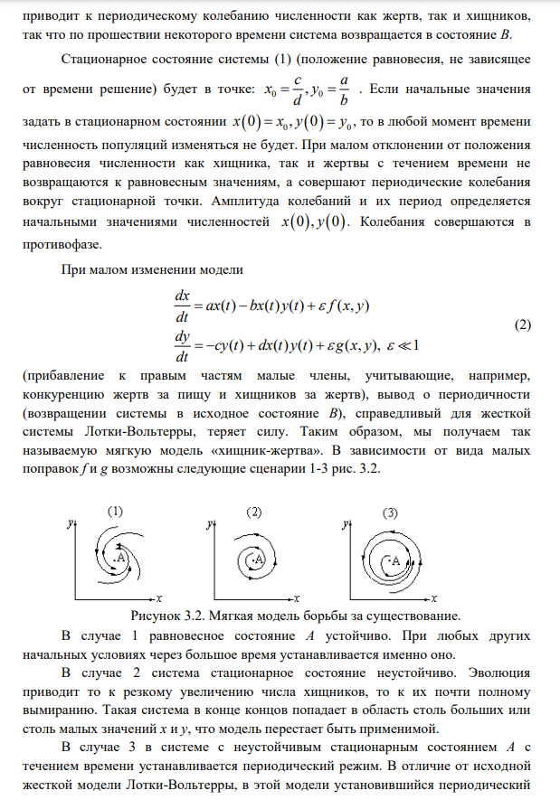
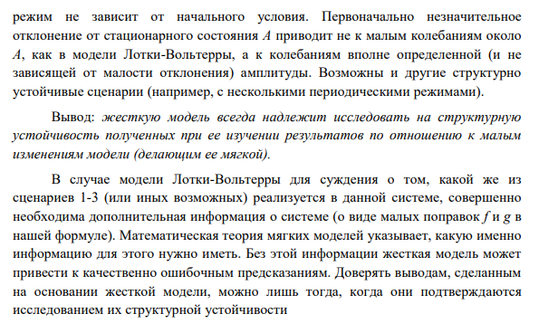
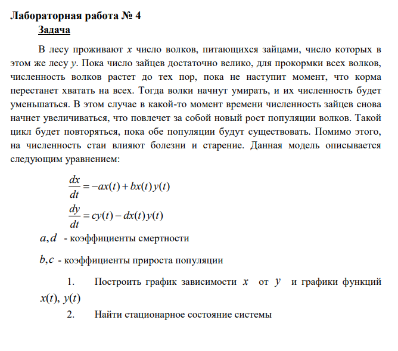
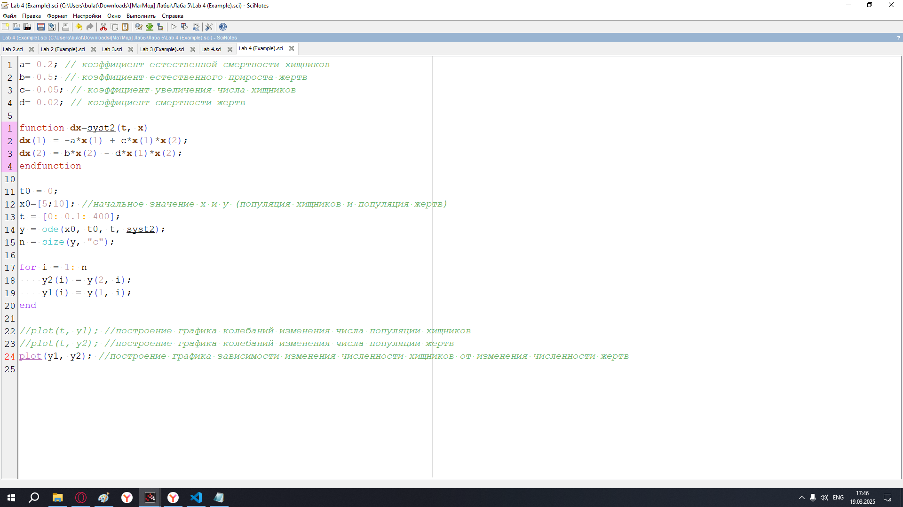
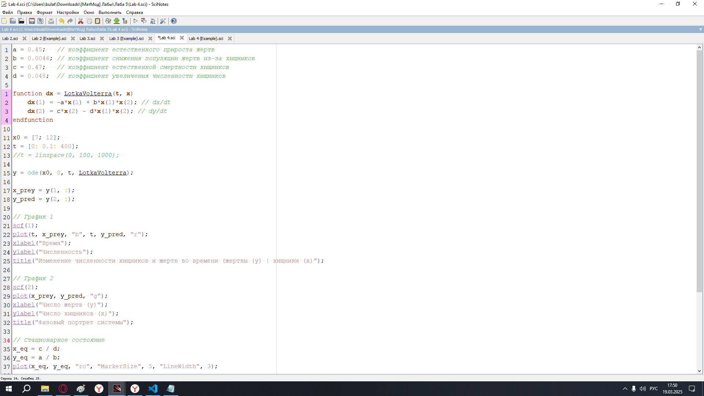
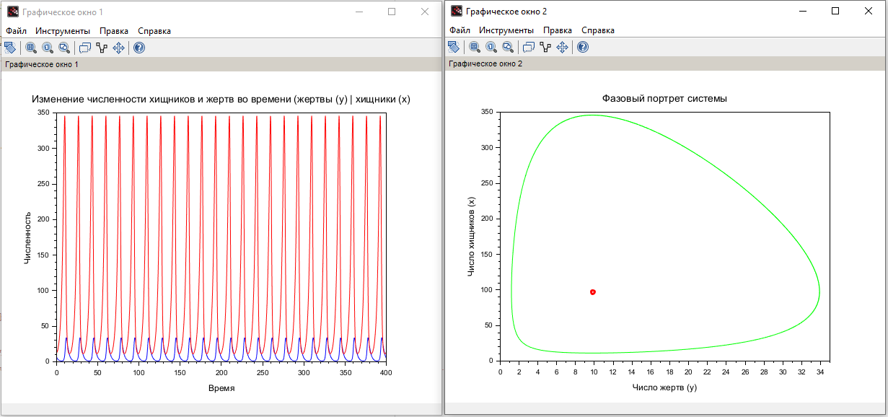

---
## Front matter
lang: ru-RU
title: Лабораторная Работа №5. Модель хищник-жертва
subtitle: Математическое моделирование
author:
  - Исаев Б.А.
institute:
  - Российский университет дружбы народов им. Патриса Лумумбы, Москва, Россия

## i18n babel
babel-lang: russian
babel-otherlangs: english

## Formatting pdf
toc: false
toc-title: Содержание
slide_level: 2
aspectratio: 169
section-titles: true
theme: metropolis
header-includes:
 - \metroset{progressbar=frametitle,sectionpage=progressbar,numbering=fraction}
 - '\makeatletter'
 - '\beamer@ignorenonframefalse'
 - '\makeatother'

## Fonts
mainfont: Arial
romanfont: Arial
sansfont: Arial
monofont: Arial
---

## Докладчик

  * Исаев Булат Абубакарович
  * НПИбд-01-22
  * Российский университет дружбы народов
  * [1132227131@pfur.ru]

## Цели и задачи

В лесу проживают х число волков, питающихся зайцами, число которых в этом же лесу у. 
Пока число зайцев достаточно велико, для прокормки всех волков, численность волков растет до тех пор, пока не наступит момент, что корма перестанет хватать на всех. 
Тогда волки начнут умирать, и их численность будет уменьшаться. 
В этом случае в какой-то момент времени численность зайцев снова начнет увеличиваться, что повлечет за собой новый рост популяции волков. 
Такой цикл будет повторяться, пока обе популяции будут существовать. 
Помимо этого, на численность стаи влияют болезни и старение. 
Данная модель описывается следующим уравнением:

dx/dt = -ax(t) + bx(t)y(t)
dy/dt = -cy(t) - dx(t)y(t)

a, d - коэффициенты смертности
b, c - коэффициенты прироста популяции

1. Построить график зависимости x от y и графики функций x(t), y(t)
2. Найти стационарное состояние системы

## Выбор варианта

{#fig:001 width=70%}

## Полученный вариант

{#fig:002 width=70%}

## Модель "Хищник-Жертва" (Часть 1)

{#fig:003 width=70%}

## Модель "Хищник-Жертва" (Часть 2)

{#fig:004 width=70%}

## Модель "Хищник-Жертва" (Часть 3)

{#fig:005 width=70%}

## Задача лабораторной

{#fig:006 width=70%}

## Код лабораторной (Scilab)

{#fig:007 width=70%}

## График

{#fig:008 width=70%}

## Выполнение задачи

{#fig:009 width=70%}

## Графики

{#fig:010 width=70%}

## Вывод

Мы научились работать с моделью Лотки-Вольтерры
