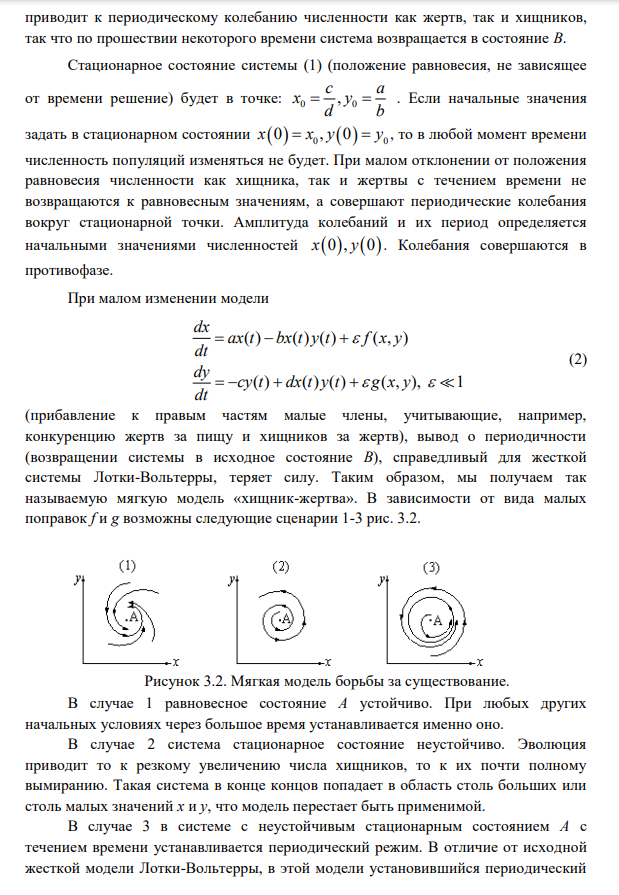
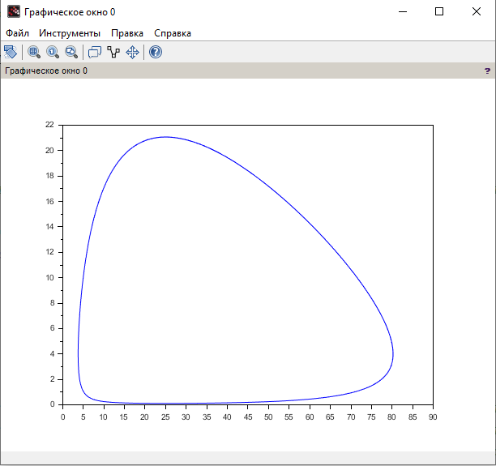

---
## Front matter
title: "Отчёт по лабораторной работе №5"
subtitle: "Дисциплина: Математическое моделирование"
author: "Исаев Булат Абубакарович НПИбд-01-22"

## Generic otions
lang: ru-RU
toc-title: "Содержание"

## Bibliography
bibliography: bib/cite.bib
csl: pandoc/csl/gost-r-7-0-5-2008-numeric.csl

## Pdf output format
toc: true # Table of contents
toc-depth: 2
lof: true # List of figures
lot: true # List of tables
fontsize: 12pt
linestretch: 1.5
papersize: a4
documentclass: scrreprt
## I18n polyglossia
polyglossia-lang:
  name: russian
polyglossia-otherlangs:
  name: english
## I18n babel
babel-lang: russian
babel-otherlangs: english
## Fonts
mainfont: Arial
romanfont: Arial
sansfont: Arial
monofont: Arial
mainfontoptions: Ligatures=TeX
romanfontoptions: Ligatures=TeX
sansfontoptions: Ligatures=TeX,Scale=MatchLowercase
monofontoptions: Scale=MatchLowercase,Scale=0.9
## Biblatex
biblatex: true
biblio-style: "gost-numeric"
biblatexoptions:
  - parentracker=true
  - backend=biber
  - hyperref=auto
  - language=auto
  - autolang=other*
  - citestyle=gost-numeric
## Pandoc-crossref LaTeX customization
figureTitle: "Рис."
tableTitle: "Таблица"
listingTitle: "Листинг"
lofTitle: "Список иллюстраций"
lotTitle: "Список таблиц"
lolTitle: "Листинги"
## Misc options
indent: true
header-includes:
  - \usepackage{indentfirst}
  - \usepackage{float} # keep figures where there are in the text
  - \floatplacement{figure}{H} # keep figures where there are in the text
---

# Цель работы

В лесу проживают х число волков, питающихся зайцами, число которых в этом же лесу у. 
Пока число зайцев достаточно велико, для прокормки всех волков, численность волков растет до тех пор, пока не наступит момент, что корма перестанет хватать на всех. 
Тогда волки начнут умирать, и их численность будет уменьшаться. 
В этом случае в какой-то момент времени численность зайцев снова начнет увеличиваться, что повлечет за собой новый рост популяции волков. 
Такой цикл будет повторяться, пока обе популяции будут существовать. 
Помимо этого, на численность стаи влияют болезни и старение. 
Данная модель описывается следующим уравнением:

dx/dt = -ax(t) + bx(t)y(t)
dy/dt = -cy(t) - dx(t)y(t)

a, d - коэффициенты смертности
b, c - коэффициенты прироста популяции

1. Построить график зависимости x от y и графики функций x(t), y(t)
2. Найти стационарное состояние системы

# Выполнение лабораторной работы

Формула для выбора варианта: `(1132227131 % 70) + 1` = 22 вариант.

{#fig:001 width=70%}

{#fig:002 width=70%}

{#fig:003 width=70%}

{#fig:004 width=70%}

{#fig:005 width=70%}

{#fig:006 width=70%}

# Код лабораторной

**Начало**

a= 0.2; // коэффициент естественной смертности хищников
b= 0.5; // коэффициент естественного прироста жертв
c= 0.05; // коэффициент увеличения числа хищников
d= 0.02; // коэффициент смертности жертв

function dx=syst2(t, x)
dx(1) = -a*x(1) + c*x(1)*x(2);
dx(2) = b*x(2) - d*x(1)*x(2);
endfunction

t0 = 0;
x0=[5;10]; //начальное значение x и у (популяция хищников и популяция жертв)
t = [0: 0.1: 400];
y = ode(x0, t0, t, syst2);
n = size(y, "c");

for i = 1: n
    y2(i) = y(2, i);
    y1(i) = y(1, i);
end

//plot(t, y1); //построение графика колебаний изменения числа популяции хищников
//plot(t, y2); //построение графика колебаний изменения числа популяции жертв
plot(y1, y2); //построение графика зависимости изменения численности хищников от изменения численности жертв

**Конец**

{#fig:008 width=70%}

# Наш код

**Начало**

a = 0.45;   // коэффициент естественного прироста жертв
b = 0.0046; // коэффициент снижения популяции жертв из-за хищников
c = 0.47;   // коэффициент естественной смертности хищников
d = 0.048;  // коэффициент увеличения численности хищников

function dx = LotkaVolterra(t, x)
    dx(1) = -a*x(1) + b*x(1)*x(2); // dx/dt
    dx(2) = c*x(2) - d*x(1)*x(2); // dy/dt
endfunction

x0 = [7; 12];  
t = [0: 0.1: 400];
//t = linspace(0, 100, 1000);  

y = ode(x0, 0, t, LotkaVolterra);

x_prey = y(1, :);
y_pred = y(2, :);

// График 1
scf(1);
plot(t, x_prey, "b", t, y_pred, "r");
xlabel("Время");
ylabel("Численность");
title("Изменение численности хищников и жертв во времени (жертвы (y) | хищники (x)");

// График 2
scf(2);
plot(x_prey, y_pred, "g");
xlabel("Число жертв (y)");
ylabel("Число хищников (x)");
title("Фазовый портрет системы");

// Стационарное состояние
x_eq = c / d;
y_eq = a / b;
plot(x_eq, y_eq, "ro", "MarkerSize", 5, "LineWidth", 3); 

**Конец**

{#fig:010 width=70%}

# Выводы

Мы научились работать с моделью Лотки-Вольтерры

# Список литературы{.unnumbered}
[@wiki:bash]

::: {#refs}
:::
