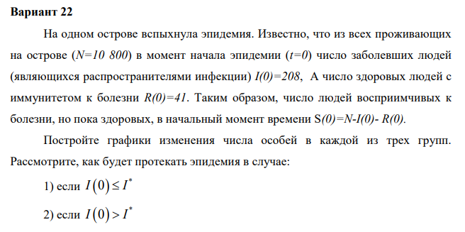
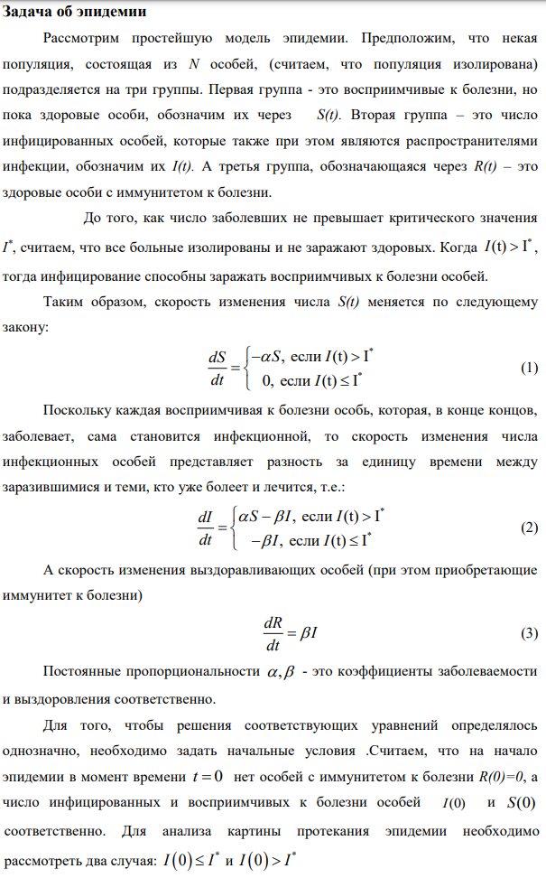
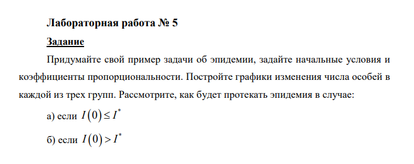
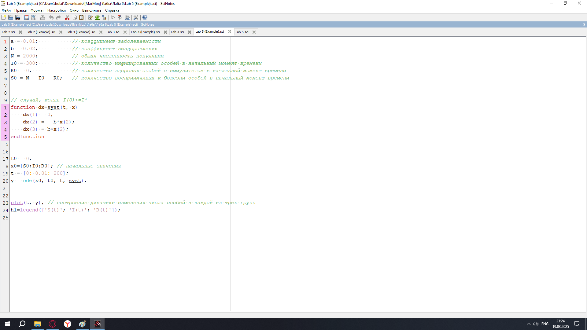
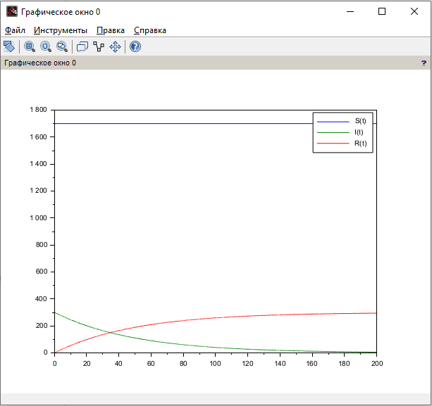
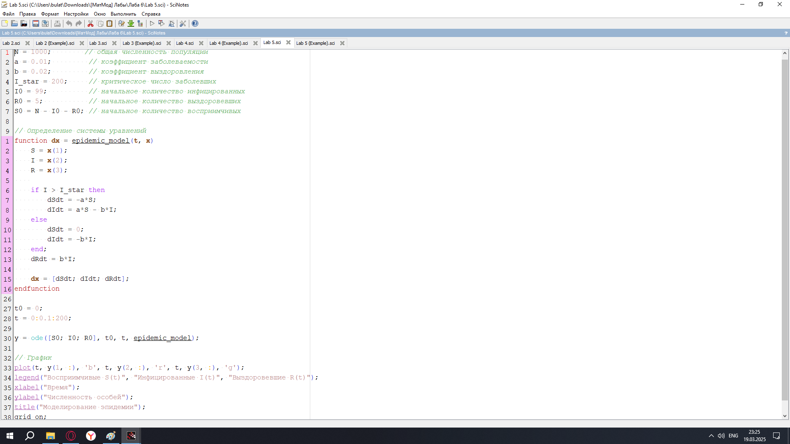
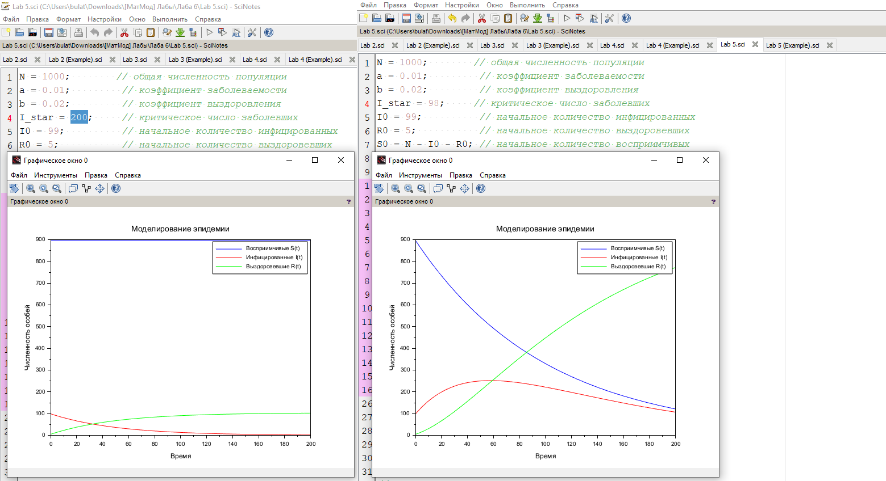

---
## Front matter
lang: ru-RU
title: Лабораторная Работа №6. Задача об эпидемии
subtitle: Математическое моделирование
author:
  - Исаев Б.А.
institute:
  - Российский университет дружбы народов им. Патриса Лумумбы, Москва, Россия

## i18n babel
babel-lang: russian
babel-otherlangs: english

## Formatting pdf
toc: false
toc-title: Содержание
slide_level: 2
aspectratio: 169
section-titles: true
theme: metropolis
header-includes:
 - \metroset{progressbar=frametitle,sectionpage=progressbar,numbering=fraction}
 - '\makeatletter'
 - '\beamer@ignorenonframefalse'
 - '\makeatother'

## Fonts
mainfont: Arial
romanfont: Arial
sansfont: Arial
monofont: Arial
---

## Докладчик

  * Исаев Булат Абубакарович
  * НПИбд-01-22
  * Российский университет дружбы народов
  * [1132227131@pfur.ru]

## Цели и задачи

Придумайте свой пример задачи об эпидемии, задайте начальные условия и коэффициенты пропорциональности. Постройте графики изменения числа особей в каждой из трех групп. Рассмотрите, как будет протекать эпидемия в случае:
а. если I(0) <= I*
б. если I(0) > I*

## Выбор варианта

{#fig:001 width=70%}

## Полученный вариант

{#fig:002 width=70%}

## Задача об эпидемии

{#fig:003 width=70%}

## Задача лабораторной

{#fig:004 width=70%}

## Код лабораторной (Scilab)

{#fig:005 width=70%}

## График

{#fig:006 width=70%}

## Выполнение задачи

{#fig:007 width=70%}

## Графики

{#fig:008 width=70%}

## Вывод

Мы научились работать с моделью об эпидемии
