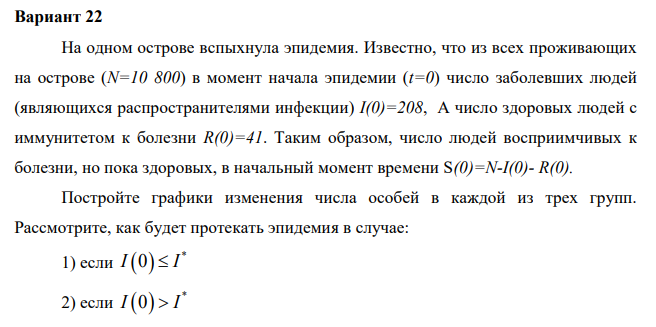
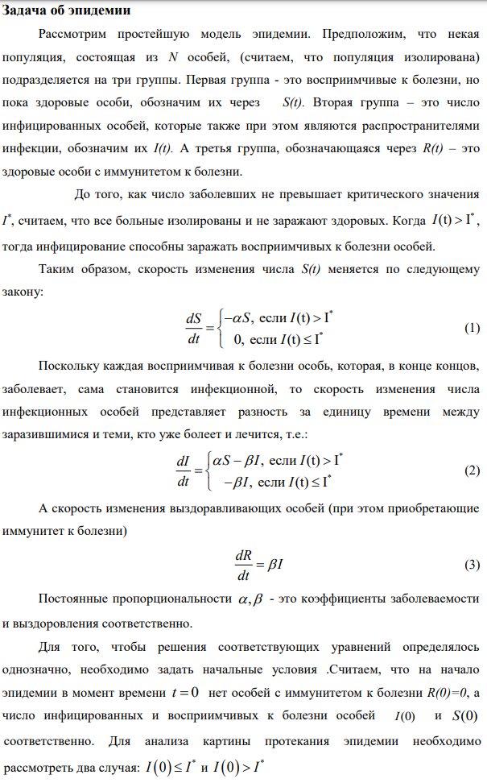
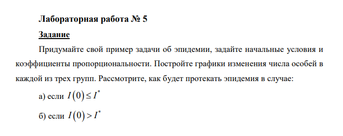
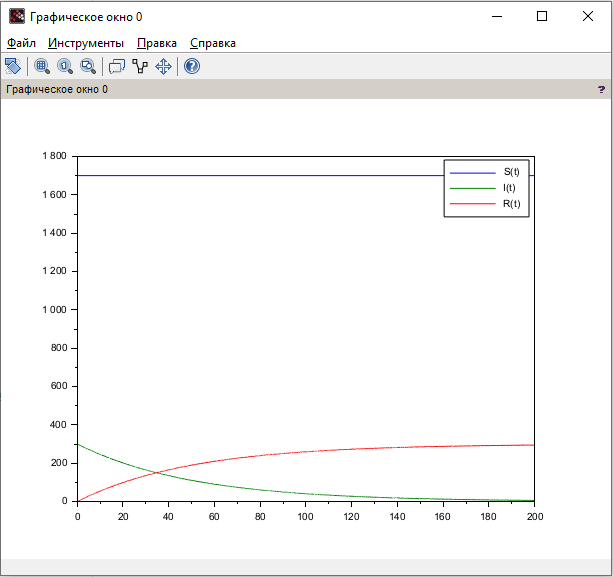
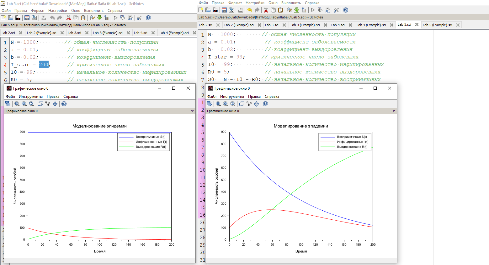

---
## Front matter
title: "Отчёт по лабораторной работе №6"
subtitle: "Дисциплина: Математическое моделирование"
author: "Исаев Булат Абубакарович НПИбд-01-22"

## Generic otions
lang: ru-RU
toc-title: "Содержание"

## Bibliography
bibliography: bib/cite.bib
csl: pandoc/csl/gost-r-7-0-5-2008-numeric.csl

## Pdf output format
toc: true # Table of contents
toc-depth: 2
lof: true # List of figures
lot: true # List of tables
fontsize: 12pt
linestretch: 1.5
papersize: a4
documentclass: scrreprt
## I18n polyglossia
polyglossia-lang:
  name: russian
polyglossia-otherlangs:
  name: english
## I18n babel
babel-lang: russian
babel-otherlangs: english
## Fonts
mainfont: Arial
romanfont: Arial
sansfont: Arial
monofont: Arial
mainfontoptions: Ligatures=TeX
romanfontoptions: Ligatures=TeX
sansfontoptions: Ligatures=TeX,Scale=MatchLowercase
monofontoptions: Scale=MatchLowercase,Scale=0.9
## Biblatex
biblatex: true
biblio-style: "gost-numeric"
biblatexoptions:
  - parentracker=true
  - backend=biber
  - hyperref=auto
  - language=auto
  - autolang=other*
  - citestyle=gost-numeric
## Pandoc-crossref LaTeX customization
figureTitle: "Рис."
tableTitle: "Таблица"
listingTitle: "Листинг"
lofTitle: "Список иллюстраций"
lotTitle: "Список таблиц"
lolTitle: "Листинги"
## Misc options
indent: true
header-includes:
  - \usepackage{indentfirst}
  - \usepackage{float} # keep figures where there are in the text
  - \floatplacement{figure}{H} # keep figures where there are in the text
---

# Цель работы

Придумайте свой пример задачи об эпидемии, задайте начальные условия и коэффициенты пропорциональности. Постройте графики изменения числа особей в каждой из трех групп. Рассмотрите, как будет протекать эпидемия в случае:
а. если I(0) <= I*
б. если I(0) > I*

# Выполнение лабораторной работы

Формула для выбора варианта: `(1132227131 % 70) + 1` = 22 вариант.

{#fig:001 width=70%}

{#fig:002 width=70%}

{#fig:003 width=70%}

{#fig:004 width=70%}

# Код лабораторной

**Начало**

a = 0.01;           // коэффициент заболеваемости
b = 0.02;           // коэффициент выздоровления
N = 2000;           // общая численность популяции
I0 = 300;           // количество инфицированных особей в начальный момент времени
R0 = 0;             // количество здоровых особей с иммунитетом в начальный момент времени
S0 = N - I0 - R0;   // количество восприимчивых к болезни особей в начальный момент времени

// случай, когда I(0)<=I*
function dx=syst(t, x)
    dx(1) = 0;
    dx(2) = - b*x(2);
    dx(3) = b*x(2);
endfunction

t0 = 0;
x0=[S0;I0;R0]; // начальные значения
t = [0: 0.01: 200];
y = ode(x0, t0, t, syst);

plot(t, y); // построение динамики изменения числа особей в каждой из трех групп
hl=legend(['S(t)'; 'I(t)'; 'R(t)']);

**Конец**

{#fig:006 width=70%}

# Наш код

**Начало**

N = 1000;        // общая численность популяции
a = 0.01;         // коэффициент заболеваемости
b = 0.02;         // коэффициент выздоровления
I_star = 200;     // критическое число заболевших
I0 = 99;          // начальное количество инфицированных
R0 = 5;           // начальное количество выздоровевших
S0 = N - I0 - R0; // начальное количество восприимчивых

// Определение системы уравнений
function dx = epidemic_model(t, x)
    S = x(1);
    I = x(2);
    R = x(3);
    
    if I > I_star then
        dSdt = -a*S;
        dIdt = a*S - b*I;
    else
        dSdt = 0;
        dIdt = -b*I;
    end;
    dRdt = b*I;
    
    dx = [dSdt; dIdt; dRdt];
endfunction

t0 = 0;
t = 0:0.1:200;

y = ode([S0; I0; R0], t0, t, epidemic_model);

// График
plot(t, y(1, :), 'b', t, y(2, :), 'r', t, y(3, :), 'g');
legend("Восприимчивые S(t)", "Инфицированные I(t)", "Выздоровевшие R(t)");
xlabel("Время");
ylabel("Численность особей");
title("Моделирование эпидемии");
grid on;

**Конец**

{#fig:008 width=70%}

# Выводы

Мы научились работать с моделью об эпидемии

# Список литературы{.unnumbered}
[@wiki:bash]

::: {#refs}
:::
