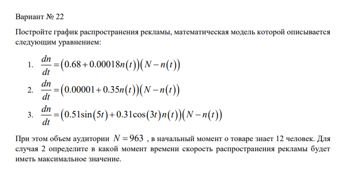
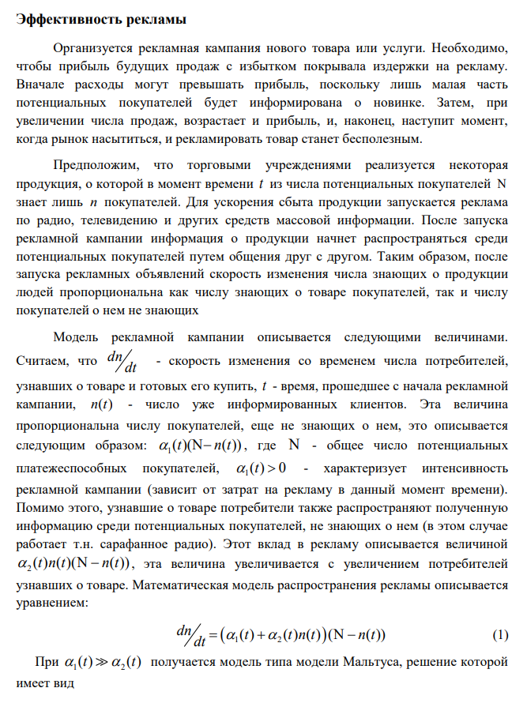
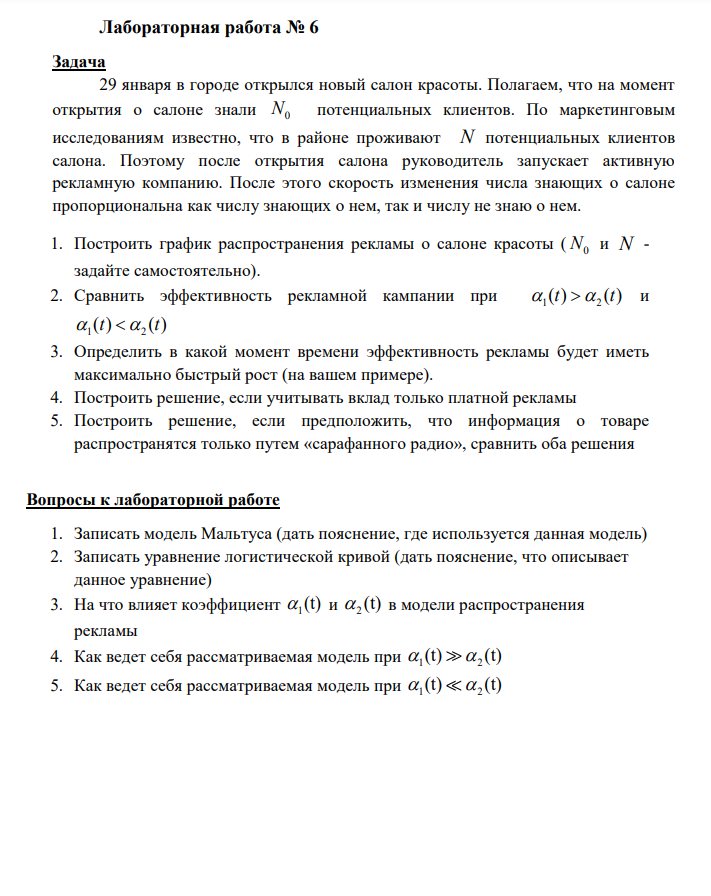
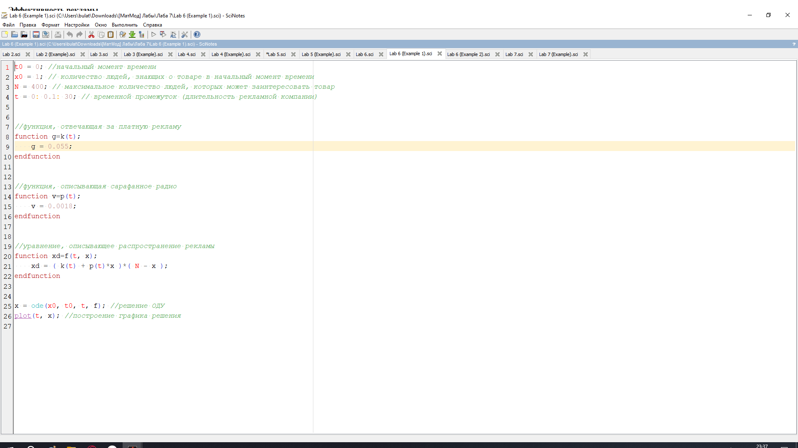
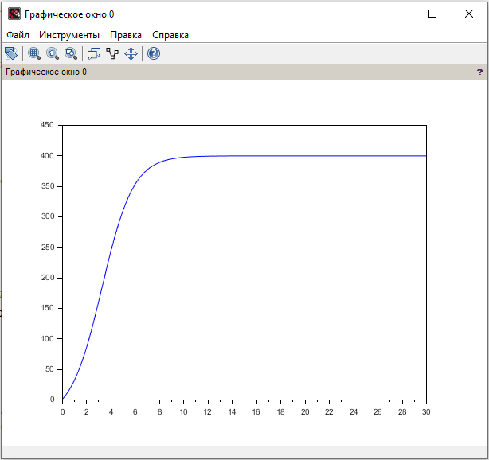
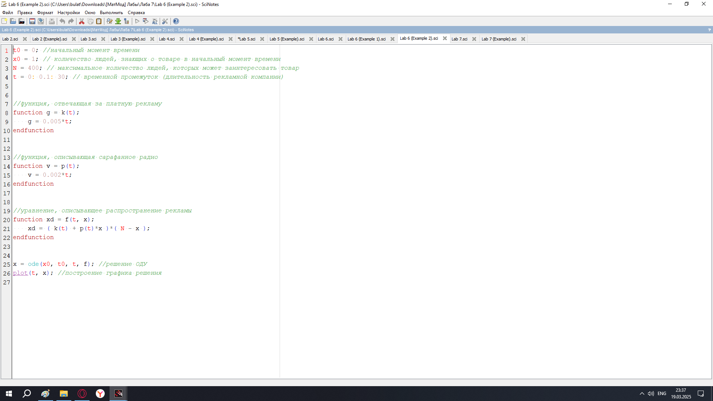
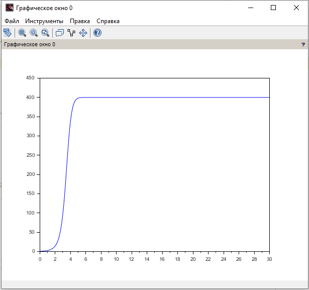
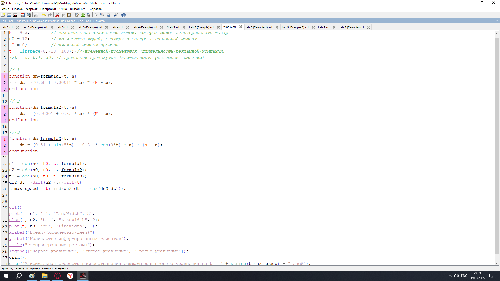
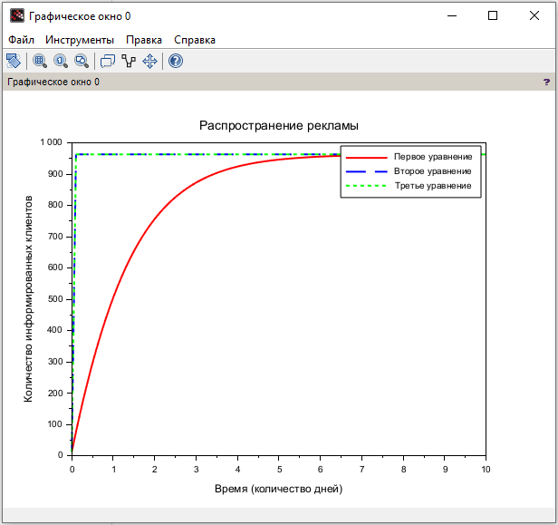

---
## Front matter
lang: ru-RU
title: Лабораторная Работа №7. Эффективность рекламы
subtitle: Математическое моделирование
author:
  - Исаев Б.А.
institute:
  - Российский университет дружбы народов им. Патриса Лумумбы, Москва, Россия

## i18n babel
babel-lang: russian
babel-otherlangs: english

## Formatting pdf
toc: false
toc-title: Содержание
slide_level: 2
aspectratio: 169
section-titles: true
theme: metropolis
header-includes:
 - \metroset{progressbar=frametitle,sectionpage=progressbar,numbering=fraction}
 - '\makeatletter'
 - '\beamer@ignorenonframefalse'
 - '\makeatother'

## Fonts
mainfont: Arial
romanfont: Arial
sansfont: Arial
monofont: Arial
---

## Докладчик

  * Исаев Булат Абубакарович
  * НПИбд-01-22
  * Российский университет дружбы народов
  * [1132227131@pfur.ru]

## Цели и задачи

29 января в городе открылся новый салон красоты. Полагаем, что на момент
открытия о салоне знали N_0 потенциальных клиентов. 
По маркетинговым исследованиям известно, что в районе проживают N потенциальных клиентов салона. 
Поэтому после открытия салона руководитель запускает активную рекламную компанию. 
После этого скорость изменения числа знающих о салоне пропорциональна как числу знающих о нем, так и числу не знаю о нем.

1. Построить график распространения рекламы о салоне красоты (N_0 и N - задайте самостоятельно).
2. Сравнить эффективность рекламной кампании при a_1(t) > a_2(t) и a_1(t) < a_2(t)
3. Определить в какой момент времени эффективность рекламы будет иметь максимально быстрый рост (на вашем примере).
4. Построить решение, если учитывать вклад только платной рекламы
5. Построить решение, если предположить, что информация о товаре
распространятся только путем «сарафанного радио», сравнить оба решения

## Выбор варианта

{#fig:001 width=70%}

## Полученный вариант

{#fig:002 width=70%}

## Пример задачи

{#fig:003 width=70%}

## Задача лабораторной

{#fig:004 width=70%}

## Код лабораторной (пример 1) (Scilab)

{#fig:005 width=70%}

## График (пример 1)

{#fig:006 width=70%}

## Код лабораторной (пример 2) (Scilab)

{#fig:007 width=70%}

## График (пример 2)

{#fig:008 width=70%}

## Выполнение задачи

{#fig:009 width=70%}

## График

{#fig:010 width=70%}

## Вывод

Мы научились работать с моделью Мальтуса
