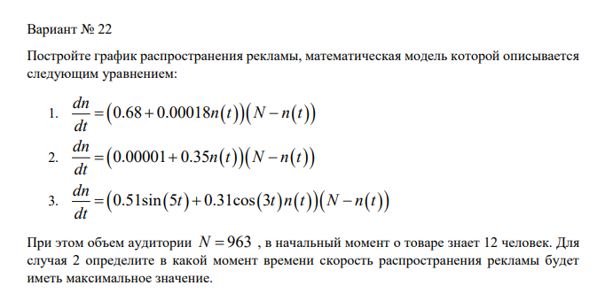
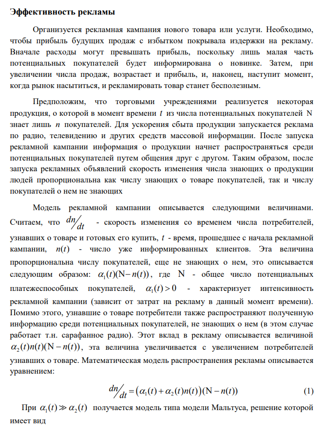
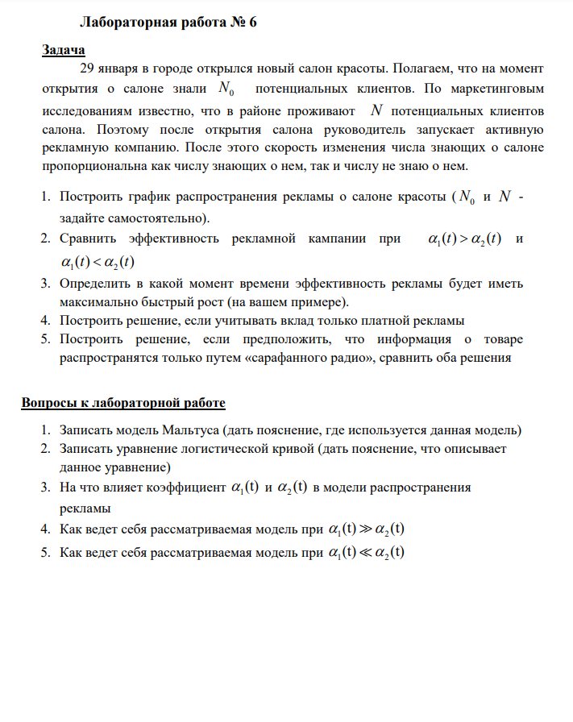
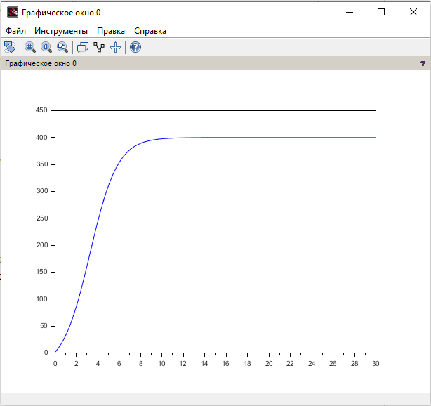
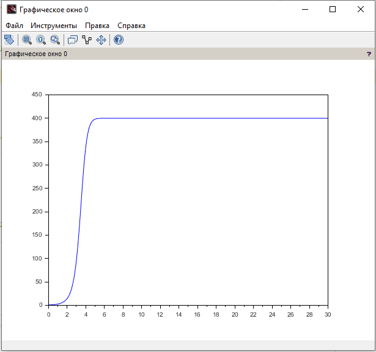
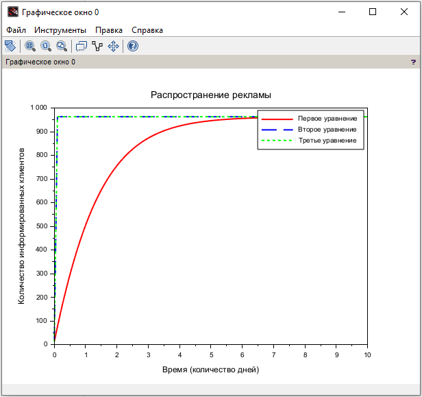

---
## Front matter
title: "Отчёт по лабораторной работе №7"
subtitle: "Дисциплина: Математическое моделирование"
author: "Исаев Булат Абубакарович НПИбд-01-22"

## Generic otions
lang: ru-RU
toc-title: "Содержание"

## Bibliography
bibliography: bib/cite.bib
csl: pandoc/csl/gost-r-7-0-5-2008-numeric.csl

## Pdf output format
toc: true # Table of contents
toc-depth: 2
lof: true # List of figures
lot: true # List of tables
fontsize: 12pt
linestretch: 1.5
papersize: a4
documentclass: scrreprt
## I18n polyglossia
polyglossia-lang:
  name: russian
polyglossia-otherlangs:
  name: english
## I18n babel
babel-lang: russian
babel-otherlangs: english
## Fonts
mainfont: Arial
romanfont: Arial
sansfont: Arial
monofont: Arial
mainfontoptions: Ligatures=TeX
romanfontoptions: Ligatures=TeX
sansfontoptions: Ligatures=TeX,Scale=MatchLowercase
monofontoptions: Scale=MatchLowercase,Scale=0.9
## Biblatex
biblatex: true
biblio-style: "gost-numeric"
biblatexoptions:
  - parentracker=true
  - backend=biber
  - hyperref=auto
  - language=auto
  - autolang=other*
  - citestyle=gost-numeric
## Pandoc-crossref LaTeX customization
figureTitle: "Рис."
tableTitle: "Таблица"
listingTitle: "Листинг"
lofTitle: "Список иллюстраций"
lotTitle: "Список таблиц"
lolTitle: "Листинги"
## Misc options
indent: true
header-includes:
  - \usepackage{indentfirst}
  - \usepackage{float} # keep figures where there are in the text
  - \floatplacement{figure}{H} # keep figures where there are in the text
---

# Цель работы

29 января в городе открылся новый салон красоты. Полагаем, что на момент
открытия о салоне знали N_0 потенциальных клиентов. 
По маркетинговым исследованиям известно, что в районе проживают N потенциальных клиентов салона. 
Поэтому после открытия салона руководитель запускает активную рекламную компанию. 
После этого скорость изменения числа знающих о салоне пропорциональна как числу знающих о нем, так и числу не знаю о нем.

1. Построить график распространения рекламы о салоне красоты (N_0 и N - задайте самостоятельно).
2. Сравнить эффективность рекламной кампании при a_1(t) > a_2(t) и a_1(t) < a_2(t)
3. Определить в какой момент времени эффективность рекламы будет иметь максимально быстрый рост (на вашем примере).
4. Построить решение, если учитывать вклад только платной рекламы
5. Построить решение, если предположить, что информация о товаре
распространятся только путем «сарафанного радио», сравнить оба решения

# Выполнение лабораторной работы

Формула для выбора варианта: `(1132227131 % 70) + 1` = 22 вариант.

{#fig:001 width=70%}

{#fig:002 width=70%}

{#fig:003 width=70%}

{#fig:004 width=70%}

# Наш лабораторной (Пример 1)

**Начало**

t0 = 0; //начальный момент времени
x0 = 1; // количество людей, знающих о товаре в начальный момент времени
N = 400; // максимальное количество людей, которых может заинтересовать товар
t = 0: 0.1: 30; // временной промежуток (длительность рекламной компании)

//функция, отвечающая за платную рекламу
function g=k(t);
    g = 0.055;
endfunction

//функция, описывающая сарафанное радио
function v=p(t);
    v = 0.0018;
endfunction

//уравнение, описывающее распространение рекламы
function xd=f(t, x);
    xd = ( k(t) + p(t)*x )*( N - x );
endfunction

x = ode(x0, t0, t, f); //решение ОДУ
plot(t, x); //построение графика решения

**Конец**

{#fig:006 width=70%}

# Наш лабораторной (Пример 2)

**Начало**

t0 = 0; //начальный момент времени
x0 = 1; // количество людей, знающих о товаре в начальный момент времени
N = 400; // максимальное количество людей, которых может заинтересовать товар
t = 0: 0.1: 30; // временной промежуток (длительность рекламной компании)

//функция, отвечающая за платную рекламу
function g = k(t);
    g = 0.005*t;
endfunction

//функция, описывающая сарафанное радио
function v = p(t);
    v = 0.002*t;
endfunction

//уравнение, описывающее распространение рекламы
function xd = f(t, x);
    xd = ( k(t) + p(t)*x )*( N - x );
endfunction

x = ode(x0, t0, t, f); //решение ОДУ
plot(t, x); //построение графика решения

**Конец**

{#fig:008 width=70%}

# Наш код

**Начало**

N = 963;        // максимальное количество людей, которых может заинтересовать товар
n0 = 12;        // количество людей, знающих о товаре в начальный момент
t0 = 0;         //начальный момент времени
//t = linspace(0, 10, 100); // временной промежуток (длительность рекламной компании)
t = [0: 0.1: 30]; // временной промежуток (длительность рекламной компании)

// 1
function dn=formula1(t, n)
    dn = (0.68 + 0.00018 * n) * (N - n);
endfunction

// 2
function dn=formula2(t, n)
    dn = (0.00001 + 0.35 * n) * (N - n);
endfunction

// 3
function dn=formula3(t, n)
    dn = (0.51 + sin(5*t) + 0.31 * cos(3*t) * n) * (N - n);
endfunction

n1 = ode(n0, t0, t, formula1);
n2 = ode(n0, t0, t, formula2);
n3 = ode(n0, t0, t, formula3);
dn2_dt = diff(n2) ./ diff(t);
t_max_speed = t(find(dn2_dt == max(dn2_dt)));

clf();
plot(t, n1, 'r', "LineWidth", 2);
plot(t, n2, 'b--', "LineWidth", 2);
plot(t, n3, 'g:', "LineWidth", 2);
xlabel("Время (количество дней)");
ylabel("Количество информированных клиентов");
title("Распространение рекламы");
legend(["Первое уравнение", "Второе уравнение", "Третье уравнение"]);
grid();
disp("Максимальная скорость распространения рекламы для второго уравнения на t = " + string(t_max_speed) + " дней");

**Конец**

{#fig:010 width=70%}

# Выводы

Мы научились работать с моделью Мальтуса

# Вопросы к лабораторной работе 

1. Записать модель Мальтуса (дать пояснение, где используется данная модель) - **dN/dt = rN, где:**
**N - численность популяции (или количество чего-либо),** 
**r - коэффициент роста (рождаемость минус смертность),** 
**t - время**

**Модель Мальтуса описывает неограниченный экспоненциальный рост популяции или количества потребителей, предполагая, что ресурсы бесконечны. Она используется в:**
**1. Экологии (анализ численности животных и растений),**
**2. Экономике (рост капитала, инвестиций),**
**3. Маркетинге (распространение товаров, клиентская база).**

2. Записать уравнение логистической кривой (дать пояснение, что описывает данное уравнение) - **dN/dt = rN(1- N/K), где:**
**K - максимальная емкость среды (предел роста)** 
**r - скорость роста** 

**Это уравнение описывает ограниченный рост, который сначала экспоненциальный, но затем замедляется из-за нехватки ресурсов. Используется в:**

**1. Популяционной динамике (ограничение численности животных, людей),**
**2. Маркетинге (насыщение рынка продуктами),**
**3. Социальных науках (распространение технологий, информации).**

3. На что влияет коэффициент a_1(t) и a_2(t) в модели распространения рекламы - **dN/dt = a_1(t)N(1 - N) a a_2(t)N, где:**
**a_1(t) - скорость распространения информации (например, эффективность рекламы). Чем выше a_1(t), тем быстрее растет аудитория** 
**a_2(t) - скорость затухания эффекта рекламы (люди забывают, теряют интерес). Чем выше a_2(t), тем быстрее уходит аудитория** 

4. Как ведет себя рассматриваемая модель при a_1(t) >> a_2(t) - **Если эффективность рекламы намного больше, чем потери аудитории, то:**
**Число пользователей стремится к максимальному значению (почти как логистическая модель). Возможен взрывной рост аудитории.**

5. Как ведет себя рассматриваемая модель при a_1(t) << a_2(t) - **Если затухание сильнее, чем распространение, то:**
**Рост будет незначительным или вообще прекратится. Аудитория будет быстро убывать.**

# Список литературы{.unnumbered}
[@wiki:bash]

::: {#refs}
:::
