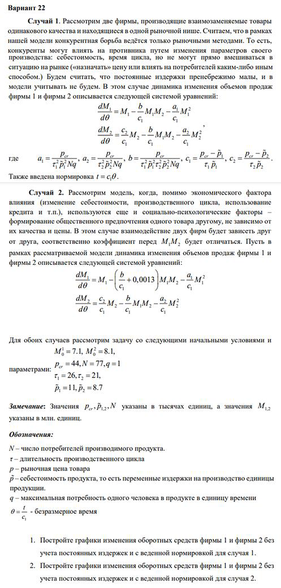
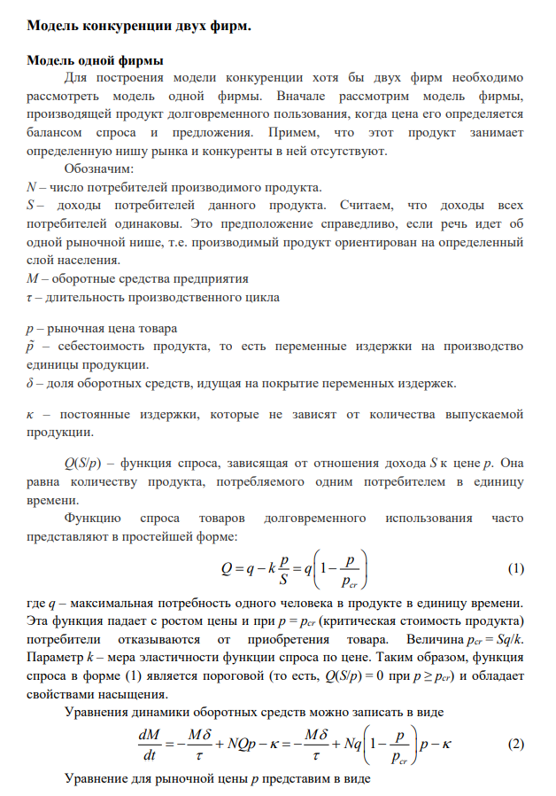
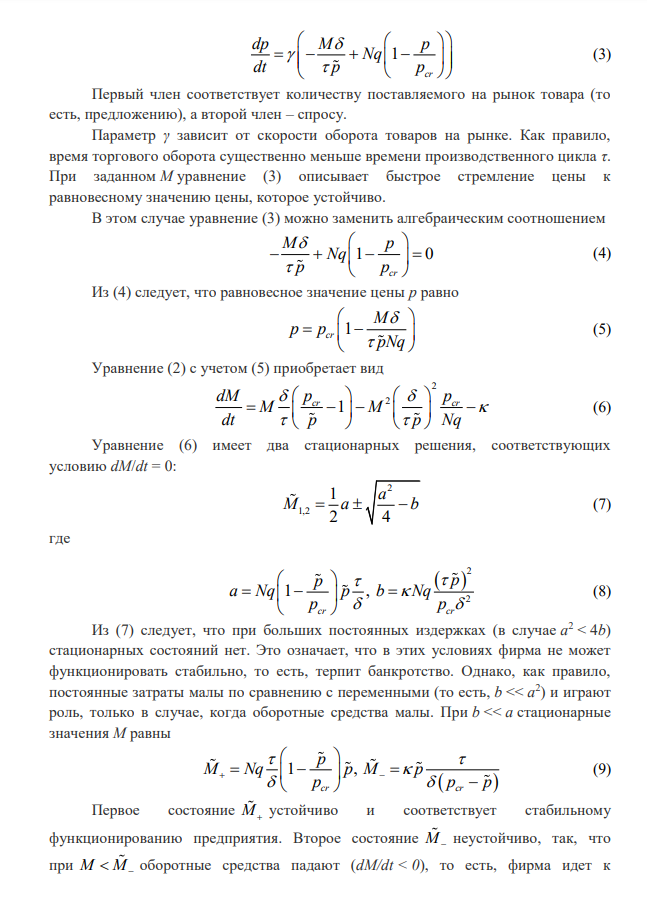
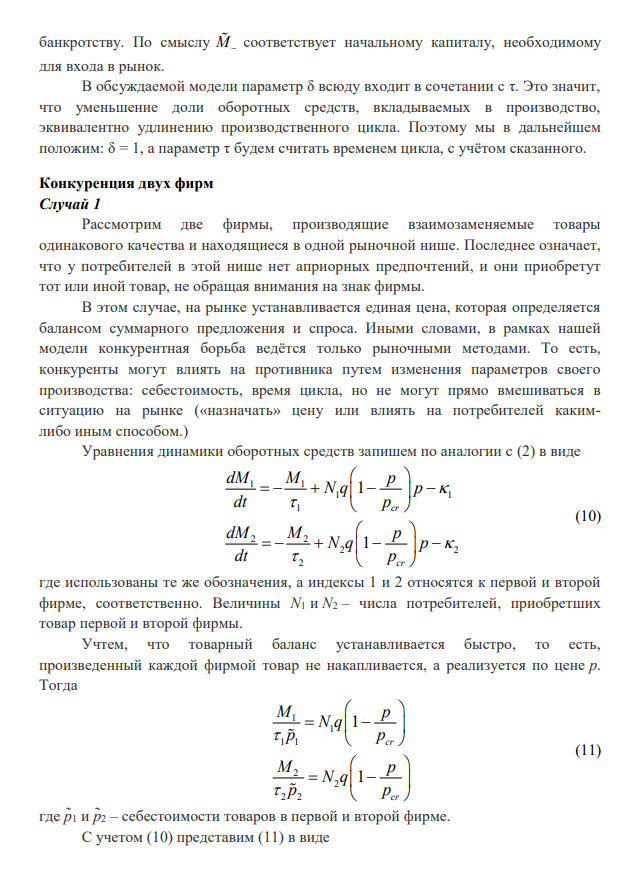
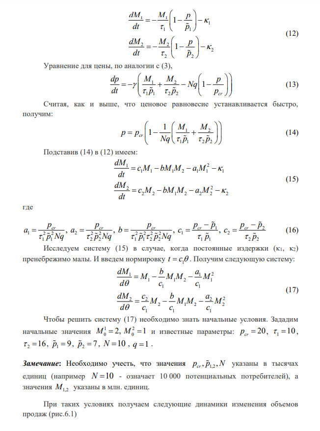
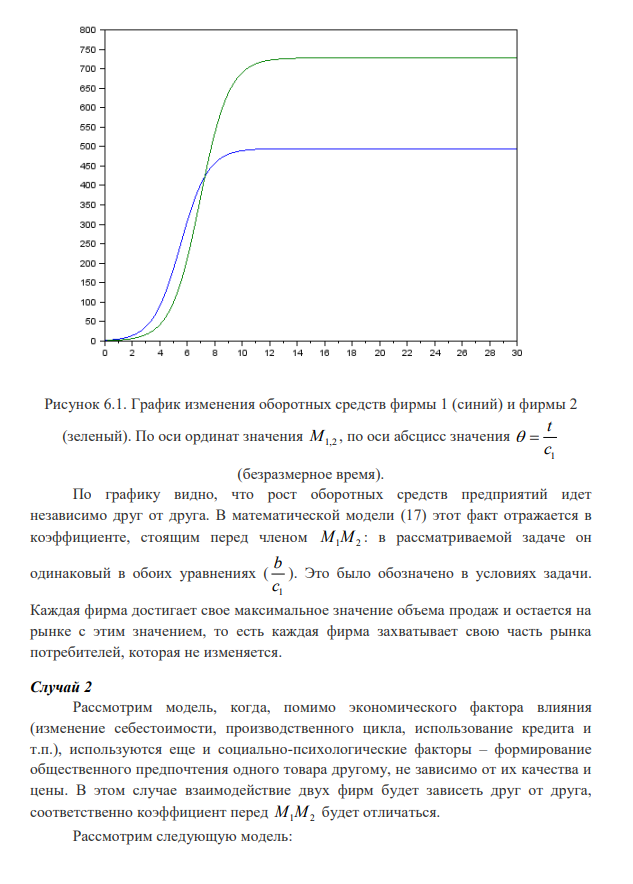
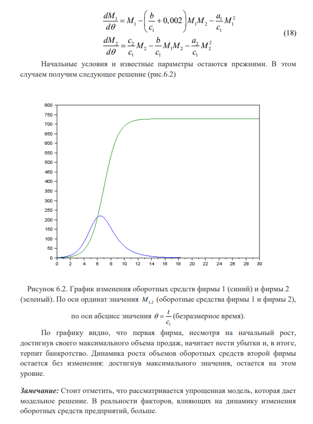
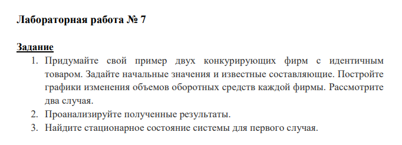
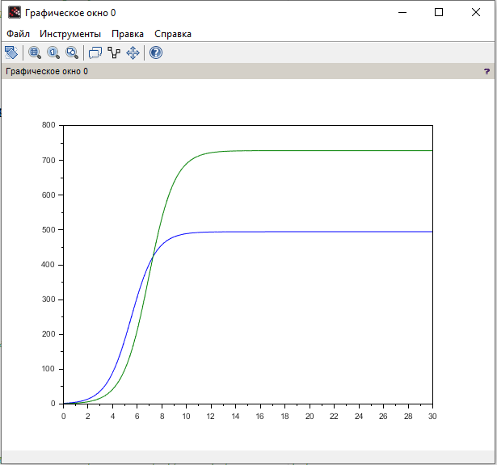
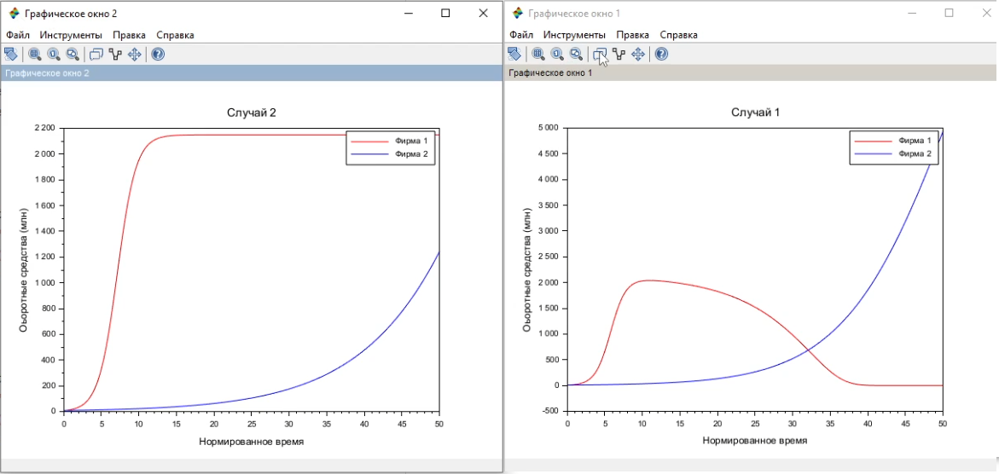

---
## Front matter
title: "Отчёт по лабораторной работе №8"
subtitle: "Дисциплина: Математическое моделирование"
author: "Исаев Булат Абубакарович НПИбд-01-22"

## Generic otions
lang: ru-RU
toc-title: "Содержание"

## Bibliography
bibliography: bib/cite.bib
csl: pandoc/csl/gost-r-7-0-5-2008-numeric.csl

## Pdf output format
toc: true # Table of contents
toc-depth: 2
lof: true # List of figures
lot: true # List of tables
fontsize: 12pt
linestretch: 1.5
papersize: a4
documentclass: scrreprt
## I18n polyglossia
polyglossia-lang:
  name: russian
polyglossia-otherlangs:
  name: english
## I18n babel
babel-lang: russian
babel-otherlangs: english
## Fonts
mainfont: Arial
romanfont: Arial
sansfont: Arial
monofont: Arial
mainfontoptions: Ligatures=TeX
romanfontoptions: Ligatures=TeX
sansfontoptions: Ligatures=TeX,Scale=MatchLowercase
monofontoptions: Scale=MatchLowercase,Scale=0.9
## Biblatex
biblatex: true
biblio-style: "gost-numeric"
biblatexoptions:
  - parentracker=true
  - backend=biber
  - hyperref=auto
  - language=auto
  - autolang=other*
  - citestyle=gost-numeric
## Pandoc-crossref LaTeX customization
figureTitle: "Рис."
tableTitle: "Таблица"
listingTitle: "Листинг"
lofTitle: "Список иллюстраций"
lotTitle: "Список таблиц"
lolTitle: "Листинги"
## Misc options
indent: true
header-includes:
  - \usepackage{indentfirst}
  - \usepackage{float} # keep figures where there are in the text
  - \floatplacement{figure}{H} # keep figures where there are in the text
---

# Цель работы

1. Придумайте свой пример двух конкурирующих фирм с идентичным товаром. 
   Задайте начальные значения и известные составляющие. 
   Постройте графики изменения объемов оборотных средств каждой фирмы. Рассмотрите два случая.
2. Проанализируйте полученные результаты.
3. Найдите стационарное состояние системы для первого случая.

# Выполнение лабораторной работы

Формула для выбора варианта: `(1132227131 % 70) + 1` = 22 вариант.

{#fig:001 width=70%}

{#fig:002 width=70%}

{#fig:003 width=70%}

{#fig:004 width=70%}

{#fig:005 width=70%}

{#fig:006 width=70%}

{#fig:007 width=70%}

{#fig:008 width=70%}

{#fig:009 width=70%}

# Код лабораторной

**Начало**

p_cr = 20; //критическая стоимость продукта
tau1 = 10; //длительность производственного цикла фирмы 1
p1 = 9; //себестоимость продукта у фирмы 1
tau2 = 16; //длительность производственного цикла фирмы 2
p2 = 7; //себестоимость продукта у фирмы 2
V = 10; //число потребителей производимого продукта
q = 1; //максимальная потребность одного человека в продукте в единицу времени

a1 = p_cr/(tau1*tau1*p1*p1*V*q);
a2 = p_cr/(tau2*tau2*p2*p2*V*q);
b = p_cr/(tau1*tau1*tau2*tau2*p1*p1*p2*p2*V*q);
c1 = (p_cr-p1)/(tau1*p1);
c2 = (p_cr-p2)/(tau2*p2);

function dx=syst(t, x)
    dx(1) = (c1/c1)*x(1) - (a1/c1)*x(1)*x(1) - (b/c1)*x(1)*x(2);
    dx(2) = (c2/c1)*x(2) - (a2/c1)*x(2)*x(2) - (b/c1)*x(1)*x(2);
endfunction

t0 = 0;
x0=[2;1]; //начальное значение объема оборотных средств x1 и х2
t = [0: 0.01: 30];
y = ode(x0, t0, t, syst);
n = size(y, "c");

plot(t, y); //построение динамики изменения оборотных средств фирмы 1 и фирмы 2

**Конец**

{#fig:011 width=70%}

# Наш код

**Начало**

P0 = 44;
N = 77;
q = 1;
tau1 = 26;
tau2 = 21;
p1 = 1.1;
p2 = 8.1;
M10 = 7.1;
M20 = 8.1;

a1 = P0 / (tau1^2 * p1^2*N*q);
a2 = P0 / (tau2^2 * p2^2*N*q);
b = P0 / (tau1^2 * p1^2*tau2^2 * p2^2*N*q);
c1 = (P0 - p1) / (tau1 * p1);
c2 = (P0 - p2) / (tau2 * p2);

function dM=system1(theta, M)
    dM = zeros(2,1);
    dM(1) = M(1) - (b/c1) * M(1)*M(2) - (a1/c1)*M(1)^2;
    dM(2) = (c2/c1)*M(2) - (b/c1)*M(1)*M(2) - (a2/c1)*M(2)^2;
endfunction

function dM=system2(theta, M)
    dM = zeros(2,1);
    dM(1) = M(1) - ((b/c1) + 0.0013) * M(1)*M(2) - (a1/c1)*M(1)^2;
    dM(2) = (c2/c1)*M(2) - (b/c1)*M(1)*M(2) - (a2/c1)*M(2)^2;
endfunction

theta = linspace(0, 50, 500);
M0 = [M10; M20];
M1 = ode(M0, 0, theta, system1);
M2 = ode(M0, 0, theta, system2);

// График 1
scf(1);
plot(theta, M1(1, :), 'r', theta, M1(2, :), 'b');
xlabel("Нормированное время");
ylabel("Оборотные средства (млн)");
legend("Фирма 1", "Фирма 2");
title("Случай 1");

// График 2
scf(2);
plot(theta, M2(1, :), 'r', theta, M2(2, :), 'b');
xlabel("Нормированное время");
ylabel("Оборотные средства (млн)");
legend("Фирма 1", "Фирма 2");
title("Случай 2");

**Конец**

{#fig:014 width=70%}

# Выводы

Мы научились работать с моделью конкуренции 1/2 фирм

# Список литературы{.unnumbered}
[@wiki:bash]

::: {#refs}
:::
